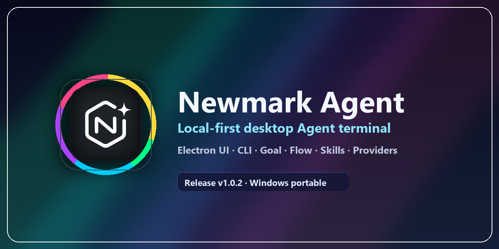

<p align="center">
  
</p>

<h1 align="center">Newmark Agent</h1>

<p align="center">
  <a href="https://github.com/positer/Newmark-Agent/releases/tag/dev-0.0.9"></a>
  
  
  
</p>

Newmark Agent is a local-first desktop Agent workspace for coding, automation, repository review, model-provider experimentation, and controlled desktop operation. It packages an Electron desktop UI, a TypeScript Agent runtime, workspace-scoped conversations, Flow workflows, subagents, skills, archives, browser/GitHub/automation tools, and configurable OpenAI-compatible, Anthropic-compatible, and GitHub Models providers.

The current source development version is **dev-0.0.9**. Newmark is intended for technical users who want an installer-backed desktop Agent app that runs against their own model credentials and keeps mutable runtime state local under `~/.Newmark`. Windows is the primary Computer Use target; Linux GUI, CLI, packaging, and terminal workflows are supported.

dev-0.0.9 maintenance update (2026-07-13): conversation execution is now addressed by a composite workspace/conversation target, with one independently stoppable Windows utility process or WSL process group per active target. Workspace switching is background-safe and latest-wins instead of resetting the global Agent. Guide input has durable accepted/applied/deferred/rejected receipts, and each run persists a public work record that stays expanded while active, folds to an elapsed-time summary when complete, and can be reopened without exposing hidden model reasoning. Expanded work records show only filtered public streamed natural language plus tool names and running/completed status; tool arguments, call IDs, commands, paths, results, and hidden reasoning are never rendered or persisted there. The fold preference remains writable after the worker is evicted by using a target-bound cold persistence path, without registering a new active runtime. The Archive action once again uses the bundled Archive icon. Editor transitions now share one dirty Save/Discard/Cancel guard, clear stale Markdown surfaces, and reject out-of-order opens. PDF preview uses a short-lived loopback HTTP capability rather than sending Chromium PDFium a `newmark-preview://` URL. The built-in browser also gains Newmark-native Browser-Use with opaque observations, target-bound host RPC, physical-page action serialization, Plan revalidation, and force-stop cancellation. Startup prewarms the actual embedded Browser guest at `about:blank`; a cold Browser-Use request initializes and binds that same guest with a bounded wait, never a hidden fallback window. Browser observations exclude password inputs, textarea values, contenteditable text, hidden DOM text, and internal option values. Long-running native tools now use bounded asynchronous child processes and carry the run cancellation signal through providers, Flow, SSH, utility workers, and WSL workers, so Guide/stop IPC remains responsive. Windows force restart snapshots PID, parent PID, and process-creation identity through Win32 Toolhelp, terminates only identity-matched handles, rescans for late descendants until three stable empty observations, and permanently quarantines an uncertain generation instead of starting a replacement. Alibaba page-agent was reviewed as an MIT architectural reference at an immutable commit; no page-agent code or runtime is bundled.

Startup now paints a dedicated Newmark prewarm window while first-run recovery, configuration/workspace state, automation, Browser Control, the selected conversation runtime, WSL detection, sidecar startup, update discovery, and a hidden fully hydrated renderer settle. Renderer attestation covers `state`, `fileTree`, `rightStatus`, `flows`, `terminal`, the prewarmed `browser` guest, and `rendered`; Electron validates all seven fields before promotion and uses the canonical `none` target for a valid first launch with no workspace. The main page is promoted only after every required stage succeeds; a required failure stays on the prewarm surface with its log path and a retry action. Update discovery includes GitHub prereleases such as `dev-0.0.9`, prompts only for a strictly newer semantic version, and shows the localized update dialog after the main UI is visible rather than interrupting prewarm. Release CDP drivers select only `index.html` and then wait for the renderer to be visible, complete, API-connected, and prompt-hydrated before bringing it forward or driving the UI, so the hidden prewarm renderer cannot bypass the startup barrier.

dev-0.0.8 restored persistent Agent terminal takeover with owner-scoped sessions, added flat same-conversation parallel Subagents with durable peer/root mailboxes, persisted context compression, and `subagent_read`, introduced a revisioned read-only Linked Plan panel available in every mode, enforced Plan through a unified schema/runtime ToolPolicy, accelerated Computer Use with persistent helpers and bounded sequences, and routed file-tree opens through header-based text/binary/HTML/PDF classification before the editor was invoked.

WSL Agent backend preview (2026-07-11): Windows settings now provide a restart-required `Windows native / WSL based` Agent backend choice. WSL mode is selectable only when at least one installed distribution is detected, and the chosen distribution is locked at application startup so active conversations are never hot-migrated between runtimes. The Electron UI and executable remain native Windows components; only the Agent backend runs as a persistent JSONL-controlled Linux process, maps Windows workspaces through `/mnt/<drive>`, and keeps configuration, conversations, and archives under the normal `~/.Newmark` user-state root. Packaged validation covers restart activation, real Linux PID reporting, WSL-local provider requests, tool writes into a Windows external workspace, and conversation isolation.

Real-model WSL validation (2026-07-11): the packaged 0.0.6 Windows UI started the Agent under Ubuntu 24.04, reported Linux PID 10, and sent both Chat Completions and Responses requests through the configured APInebula `gpt-5.4-mini` provider. Per-run random markers returned in 4.873 seconds for `chat` and 5.702 seconds for `responses`, and each result persisted under its requested isolated conversation id. The repeatable smokes copy configuration into a temporary root, verify the active API mode in renderer state, and check that provider credentials do not appear in returned content.

Windows large-workspace startup correction (2026-07-12): the unresponsive 0.0.7 window was traced to the right file tree, not configuration migration, conversation state, GPU composition, WSL detection, or terminal startup. The 0.0.6 change that correctly rooted the tree at the active workspace exposed the older recursive `walkTree` implementation to large real workspaces. The local `Code` workspace contains 84,769 visible entries; the old path serialized 15.91 MiB and the renderer attempted to create roughly 347,000 DOM elements, twice during startup. The backend now returns one directory level asynchronously, rejects lexical and linked-path expansion outside the active workspace, and the renderer requests children only when a folder is first expanded. Hidden sidebars no longer scan, the duplicate startup request was removed, and stale workspace config files can no longer override the four user-level sidebar layout keys. Validation passes 987 assertions, three consecutive runtime-layout UI smokes cover lazy expansion/file opening/boundary rejection, and the real `Code` workspace remained responsive for 60 seconds with 133 root rows, 196 rows after three nested expansions, 7 ms idle CDP response, and 4 ms input response. Source smokes explicitly suppress development DevTools because a docked panel can reduce the renderer viewport without changing the outer window and create a false clipping failure; packaged builds are unaffected.

Native editor highlight correction (2026-07-12): files could be read and edited while appearing blank because the transparent input textarea relied on the syntax-highlight layer for visible text, but the opaque Copilot ghost layer remained above that highlight layer even when no prediction existed. The ghost layer now defaults to hidden, becomes visible only for a current anchored prediction, and hides immediately after typing, dismissal, or caret movement. Final dev-0.0.7 validation passes 991 assertions and the packaged native-editor smoke covers normal highlighted text, inline prediction, caret invalidation, Tab acceptance, and save. The current local `Program Files` installation, including the later titlebar icon correction, uses `app.asar` SHA-256 `692BB4B0D5CA2CE19351FDB32444BEF3DB7D3AD73D1E11AF07DC308EE12F0AFF`; real `_decode_title.py` inspection showed 1,039 source characters, 1,040 highlighted characters, a hidden empty ghost layer, and visibly rendered Python token colors.

Maintenance update (2026-07-11): same-workspace conversations now remain strictly isolated. Conversation-scoped state reads no longer overwrite the requested transcript with the shared backend host transcript, delayed conversation loads are rejected after a switch, and completed runner state is merged directly into its own persisted conversation key. Packaged Windows validation covers rapid switch-back, deliberately out-of-order state responses, multi-window shared-backend operation, and cross-workspace isolation.

Archive and narrow-window follow-up (2026-07-11): archiving a conversation now atomically writes its Markdown archive and removes the target conversation from persisted and in-memory registries, including exact non-empty duplicate registrations, so it stays absent after refresh and restart. Distinct conversations that only share a title remain separate and receive a short id suffix in the list. The input toolbar now preserves a readable model label and fixed send action across narrow layouts, temporarily hiding sidebars only while the window is very narrow without changing saved layout state.

Model validation follow-up (2026-07-11): Newmark now runs its own two-stage model validation. It gathers network evidence from the provider model catalog and Newmark's built-in web search restricted to the provider's official domain, then submits real text, visual recognition, and image-generation tasks. Vision and image output are confirmed only by successful task results; names and catalog hints only decide which probes to run. The model selector shows validated-available and unvalidated models while hiding validated-unavailable/error models.

Native editor follow-up (2026-07-11): the right sidebar now contains a dependency-free Newmark text/code editor with line numbers, built-in syntax highlighting, a compact Vim command mode, undo/redo, save/dirty state, and Agent assistance. Markdown preview is an editor view toggle shown only for Markdown files. Copilot prediction is opt-in and debounced; it prefers a validated GitHub Copilot provider, cancels stale candidates while typing, accepts with `Tab`, and dismisses with `Esc`. The implementation was designed after reviewing Ace, CodeMirror, Monaco, Neovim, and CodeMirror Vim architecture, but no editor runtime or source code was imported.

File-tree polish (2026-07-11): expanding an empty child directory now leaves the branch empty instead of rendering an extra “Empty directory” row. The root-level empty-workspace message remains available.

Conversation actions (2026-07-11): user and Agent messages now expose a compact Copy action. User messages also expose Edit, which rewinds the current conversation to the selected user node, removes that node and all later model/display history, restores the original text to the prompt, and lets the user resend an edited branch. Rewind is conversation-scoped, persisted, and blocked while that conversation is running.

Provider compatibility follow-up (2026-07-11): OpenAI-compatible parsing now accepts Chat Completions string/content-part arrays, legacy `choices[].text`, Responses `output_text`, nested `output[].content[].text`, and compatibility-gateway `text.value` shapes. Context compression treats empty or controlled error responses as failures and uses the local fallback summary instead of persisting a false model-generated summary.

Copilot startup and editor binding follow-up (2026-07-11): model startup skips empty provider groups and replaces an empty or unavailable saved model with the first selectable model, synchronizing it to the backend. Editor prediction/Agent assist is bound to the model selected in the current conversation toolbar; it no longer forces GitHub Copilot. Real local validation showed 21 selectable GitHub Copilot models and 7 APInebula models, with editor requests returning the selected provider in both directions.

Context-limit compression follow-up (2026-07-11): compression is now driven by the selected model's context window instead of only a fixed character threshold. Newmark reserves output capacity, starts compression near 78% of the usable window, targets roughly 55% after compression, caps summary input/output, and retains recent history from a complete user turn so tool results are not detached from their request. The implementation remains native and compact with no tokenizer or summarization dependency. OpenAI Chat/Responses and Anthropic normal/tool/stream response text all pass through one recursive text normalizer.

Tray lifecycle follow-up (2026-07-11): the desktop tray icon is now created when the main window starts and remains the same live tray instance while the window is visible, hidden, restored, or minimized. Minimize behavior follows `ui.minimize_to_tray`, while the close button independently follows `general.close_behavior`; choosing direct close exits the process and removes the tray without leaving a background instance.

Editor prediction follow-up (2026-07-11): model code predictions now render directly at the caret as subdued gray ghost text on the code layer instead of appearing in a detached dark popup. `Tab` accepts the complete candidate into the editor, while `Esc` dismisses it; the request remains bound to the model selected by the current conversation.

Multimodal and interaction hardening (2026-07-11): pasted images now travel as native structured image input through Windows, WSL, OpenAI Chat, Responses, and Anthropic request paths instead of being flattened into Markdown text. Non-validated vision models reject attachments explicitly, while image-output models expose a native `image_generate` tool backed by the provider image-generation endpoint. The editor toolbar is fixed-size and icon-only, Copilot prediction is enabled by default with a 500 ms idle trigger, file-aware highlighting is restored, and duplicate clipboard image events are collapsed. Option questions are conversation-scoped, remain stable across state refreshes, and resume only after every simultaneously displayed question is answered.

Single-instance hardening (2026-07-11): a second launch now restores and focuses the existing main window rather than creating another window. The lock is independent of executable location; validation launched `Newmark Agent.exe` from `release/win-unpacked` and then the same-named installed executable from `Program Files`, confirmed the second process exited, and observed one renderer page and one top-level executable path.

Runtime-layout correction (2026-07-12): Windows settings present **Agent runtime environment** as a normal list with Windows native and WSL choices; the WSL choice remains disabled when no initialized distribution is available. The input toolbar no longer clips the running/send button's hover transform or animated border. The right file tree now defaults to the active workspace rather than the `~/.Newmark` runtime root, preventing internal `Roots` shadow storage and configuration files from appearing as nested workspace content.

Editor placement and completion-anchor correction (2026-07-12): all editor toolbar icons, including Markdown Preview, use a fixed centered 15 px icon registration inside a 30 px button and cannot escape the control box. Inline model predictions are bound to the exact file path, editor content, and selection range that produced them. Clicking, selecting, navigating with the keyboard, or otherwise moving the caret immediately removes the old candidate, cancels stale asynchronous responses, and restarts the 500 ms idle timer at the new position; `Tab` accepts only a candidate whose anchor still matches.

Adaptive application icons (2026-07-12): Newmark now uses the supplied finished dark and light N icons throughout the desktop shell. Windows and Linux windows, the taskbar application entry, and the persistent tray refresh from the operating-system color scheme at runtime; the custom titlebar follows Newmark's selected application theme and consults the operating-system scheme only in System mode. Startup ordering is regression-tested so tray creation cannot call the native icon refresher before initialization. Windows still embeds one static multi-size dark-mark ICO for Explorer and Task Manager's executable-details view because those shell surfaces do not support runtime light/dark icon selection.

Active visual inspection (2026-07-12): validated vision models now receive an `image_inspect` tool for images submitted in the latest user message. The Agent can query exact source dimensions, select an image by 1-based index, crop a source-pixel rectangle, and magnify it by 1-4x while keeping output within 2048 pixels per side. PNG and JPEG decoding, bounds checks, and bilinear RGBA scaling run identically in Windows, Linux, and the WSL Agent backend. Derived crops are returned as structured image tool content for the current model turn only: base64 is removed from visible tool text, no temporary file is created, and the crop is omitted from persisted conversation history. The design follows Codex's public `view_image` boundary of vision capability gating and structured `input_image` results, while Newmark's crop/index implementation is original.

Work-completion review and input-stack polish (2026-07-12): every completed Agent turn that changes files now appends a conversation-bound review card with the changed-file count, per-file additions/deletions, expandable rows, and a Review detail window. The card is restored only with its owning conversation and survives transcript rerenders without duplicating or leaking into another conversation. Task, Queue, and Goal controls are now compact 30-31 px control bands with restrained surfaces, an explicit Goal state marker, preserved edit/pause/drag interactions, and clear separation from the prompt. Source tests pass 982 assertions, while the Electron smoke verifies all five review rows, the detail window, and non-overlapping bar geometry.

Application-theme title icon correction (2026-07-12): the custom titlebar icon now follows Newmark's selected application theme instead of always following the operating-system scheme. Dark application mode uses the supplied black finished icon with its white mark (`app-icon-dark.png`); light mode uses the supplied white finished icon with its dark mark (`app-icon-light.png`); System mode alone listens for live operating-system light/dark changes. Newmark does not synthesize a black or white icon background in CSS. Source and packaged tests lock both supplied PNG SHA-256 values so later builds cannot silently replace their content. The rebuilt package passed all 991 assertions, four-state Electron theme switching, packaged icon/hash validation, and installed `Program Files` dark/light screenshot inspection. Window, taskbar, and tray native icons remain managed independently by Electron's native theme path.

Linux release isolation correction (2026-07-12): Windows-triggered Linux packaging no longer runs against the mapped workspace's Windows `node_modules`. The release script creates a temporary WSL ext4 build root, synchronizes source without generated/dependency directories, installs Linux-native dependencies with `npm ci`, builds AppImage/deb/unpacked packages there, and copies only verified release outputs back to `release/`. This prevents native packages such as esbuild from silently using the wrong platform binary while leaving the Windows dependency tree unchanged.

Windows startup follow-up (2026-07-12): the startup shell and full UI navigation are now strictly serialized. The Agent waits for the lightweight shell navigation to finish before loading `index.html`, preventing the installed renderer from being replaced or terminated by a late shell load. Empty Task and Queue controls are hidden before state hydration, so no empty bar flashes during startup.

## Commercial Development Positioning

Newmark Agent is being developed as a local-first commercial desktop workbench for engineering teams, independent developers, repository maintainers, and organizations that need auditable Agent operation without moving workspace state into a Newmark-hosted cloud. Customers bring their own compatible model/provider credentials; mutable configuration, transcripts, archives, work records, and credentials remain under the user's selected local state root.

The product boundary is intentionally modular: model providers, skills, Flow definitions, local/SSH workspaces, and host tools can be configured independently, while high-impact desktop capabilities remain mediated by explicit runtime targets, mode policy, capability tokens, and visible stop/review surfaces. This makes the source line suitable for controlled pilots, internal deployment evaluation, integration development, and commercial customization. It is still a development preview rather than an SLA-certified production service; organizations remain responsible for provider terms, credential handling, model-output review, backup policy, and release qualification in their own environment.

First-party Newmark code and project assets remain proprietary and all-rights-reserved unless separate written release or commercial metadata grants additional rights. Third-party packages and reference projects retain their own licenses; architectural references are not automatically bundled dependencies.

## At A Glance

| Area | What Newmark provides |
|---|---|
| Desktop shell | Windows MSI install plus `win-unpacked` update pack, with Linux AppImage/deb builds and local user-state storage. |
| Agent runtime | Build, Plan, Goal, Flow, subagents, queued input, and live work events. |
| Isolated conversation runtimes | Workspace/conversation composite targets, background execution, target-only stop/restart, durable Guide receipts, and persisted foldable work records. |
| Model providers | OpenAI-compatible, Anthropic-compatible, GitHub Models/Copilot login flow, and local runtimes through normal provider settings. |
| Repository work | Local Git inspection, GitHub audit, branch/fork/PR helpers, and remote-repository security review prompts. |
| Computer Use | Native Windows observe/action flow with ephemeral screenshots, UI Automation objects, app-scoped control, and a visible takeover border. Linux reports native desktop control as unsupported instead of crashing. |
| Built-in Browser-Use | Native observe-then-act control with opaque refs, fixed isolated-world programs, target-bound host RPC, shared-page serialization, and popup/download/navigation guards. |
| Terminal takeover | Persistent Agent-owned terminal sessions independent from one-shot shell tools, available in desktop and CLI Agent paths with PowerShell on Windows and bash on Linux. |
| Workspace control | Local, external, and SSH-linked workspaces with exact-folder uniqueness and parent/child folder support. |
| Privacy posture | Local-first config; provider keys stay in local runtime config or environment files and must not be committed. |

## Download

The latest published development preview is **dev-0.0.9**. It is distributed as an unsigned GitHub prerelease after complete local Windows/Linux acceptance and post-publication asset verification.

| Package | Release |
|---|---|
| Windows MSI installer | `Newmark-Agent-0.0.9-x64.msi` |
| Windows unpacked update pack | `Newmark-Agent-0.0.9-win-unpacked-x64.zip` |
| Linux AppImage | `Newmark-Agent-0.0.9-x86_64.AppImage` |
| Linux Debian package | `Newmark-Agent-0.0.9-amd64.deb` |
| Linux unpacked update pack | `Newmark-Agent-0.0.9-linux-unpacked-x64.zip` |

Download the assets from the [dev-0.0.9 GitHub prerelease](https://github.com/positer/Newmark-Agent/releases/tag/dev-0.0.9). On Windows, install the MSI for managed desktops or use the `win-unpacked` zip as the no-loss update source. On Linux, run the AppImage or install the `.deb` package. The distributions include `LICENSE` and `THIRD_PARTY_NOTICES.md`.

The Windows MSI is a per-machine installer and targets `Program Files`, requesting elevation through Windows Installer. Regardless of whether Newmark runs from Program Files, an unpacked folder, a removable drive, or another installation path, mutable configuration, conversations, archives, and credentials are resolved from `~/.Newmark` and preserved across upgrades. An installation directory passed back as `--root` is normalized to `~/.Newmark`; explicit non-install roots remain available for isolated tests.

## Quick Start

```powershell
git clone https://github.com/positer/Newmark-Agent.git
cd Newmark-Agent\DESKTOP
npm.cmd install
npm.cmd test
npm.cmd run dist:windows-release
```

The packaged Windows executable is written to:

```text
release/Newmark-Agent-0.0.9-x64.msi
release/Newmark-Agent-0.0.9-win-unpacked-x64.zip
```

Linux and WSLg development builds use native Linux Node/npm inside the distro:

```bash
git clone https://github.com/positer/Newmark-Agent.git
cd Newmark-Agent/DESKTOP
npm install
npm test
npm run dist:linux
npm run release:linux-gui-smoke
```

Maintainers with a local real-provider config can also run the Linux packaged real-model gate. By default it reads the local `_local/real-ui-user-test/config.json` config and redacts API keys from output:

```bash
cd DESKTOP
npm run release:linux-real-provider-smoke
```

Linux artifacts are written to:

```text
release/Newmark-Agent-0.0.9-x86_64.AppImage
release/Newmark-Agent-0.0.9-amd64.deb
release/Newmark-Agent-0.0.9-linux-unpacked-x64.zip
```

The GUI smoke test expects WSLg or another Linux display server with `DISPLAY` or `WAYLAND_DISPLAY` set.

## Configuration

Newmark stores runtime configuration locally. Keep real API keys out of Git. Use provider keys only in local runtime config, local env files, or machine environment variables.

`DESKTOP/config.example.json` is included in source and packaged builds as a recovery template. If `config.json` is damaged, Newmark backs it up and recovers from the example/default config. Normal first-run defaults remain provider-empty.

Example provider shape:

```json
{
  "models": {
    "providers": [
      {
        "name": "my-provider",
        "base_url": "https://api.example.com/v1",
        "api_key": "YOUR_LOCAL_KEY",
        "protocol": "openai",
        "enabled": true,
        "models": [
          {
            "name": "my-model",
            "display": "My Model",
            "max_tokens": 128000,
            "vision": false,
            "thinking": false
          }
        ]
      }
    ],
    "default_model": "my-model"
  },
  "general": {
    "language": "auto"
  }
}
```

For Anthropic-compatible providers, set `"protocol": "anthropic"`. GitHub Models/Copilot uses the explicit browser-login flow in Settings and is not imported through fuzzy provider injection.

## Core Capabilities

| Capability | Status |
|---|---|
| Workspace-scoped conversations and archives | Available |
| Build / Plan / Goal / Flow modes | Available |
| Subagents and installable skills | Available |
| Safe Markdown display for headings, tables, links, images, and formulas | Available |
| Rootless pasted-image prompt attachments | Available |
| Model validation with multimodal metadata persistence | Available |
| Auto model switching and context-window checks | Available |
| GitHub file audit and repository security audit | Available |
| Native OpenSSH external workspace linking | Available |
| Computer Use with one-time screenshots and UI Automation summaries | Available |
| Single-conversation Computer Use ownership lock | Available |
| Native built-in Browser-Use with target and page isolation | Available and locally package-validated in dev-0.0.9 |
| Durable Guide receipts and foldable elapsed-time work records | Available and locally package-validated in dev-0.0.9 |
| Continuous closed-loop Computer Use takeover border | Available |
| Persistent terminal takeover sessions | Available |
| Native built-in tool switches in Settings | Available |
| Layout/sidebar state memory and workspace/conversation pinning | Available |

## Development

```powershell
cd DESKTOP
npm.cmd install
npm.cmd test
npm.cmd run dist:windows-release
```

Useful release gates:

```powershell
cd DESKTOP
npm.cmd test
npm.cmd run release:cli-smoke
npm.cmd run release:111-cli-smoke
npm.cmd run release:111-ui-smoke
npm.cmd run release:computer-use-vision-smoke
npm.cmd run release:ui-media-md-smoke
npm.cmd run release:ui-conversation-queue-plan-smoke
npm.cmd run release:ui-fast-conversation-switch-smoke
npm.cmd run release:ui-workspace-conversation-isolation-smoke
npm.cmd run release:ui-multi-window-shared-backend-smoke
npm.cmd run test:dev009
npm.cmd run release:dev009-features-smoke
```

Linux/WSLg release gates:

```bash
cd DESKTOP
npm test
npm run dist:linux
npm run release:linux-gui-smoke
```

The `release:111-*` smoke names are historical regression gates for the current feature set; they are retained even though the source development version is now `0.0.9`.

Unpacked update dry-runs can be delegated to the packaged CLI before copying files:

```powershell
release\win-unpacked\Newmark Agent.exe install-update --check-github --repo positer/Newmark-Agent
release\win-unpacked\Newmark Agent.exe install-update --from-github --repo positer/Newmark-Agent --expected-version 0.0.9 --dry-run
release\win-unpacked\Newmark Agent.exe install-update --source C:\path\to\new\win-unpacked --target C:\path\to\current\install --expected-version 0.0.9 --dry-run
```

The update helper preserves local state by default. Current installer/update builds also keep mutable state outside the installation directory under `~/.Newmark`, including `config.json`, `Work/`, `skills/`, `Memory Lab/`, and `archive/`.

Opt-in real-provider validation is available through environment variables and is skipped when credentials are absent. These scripts are intended for maintainers who explicitly accept provider spend:

```powershell
cd DESKTOP
npm.cmd run release:real-provider-smoke
npm.cmd run release:real-apinebula-memory-switch-smoke
npm.cmd run release:real-provider-stress
```

## dev-0.0.9 Notes

dev-0.0.9 is the current source maintenance line. It replaces conversation-id-only runtime identity with deterministic workspace/conversation targets, introduces per-target Windows utility and WSL runtime pools, keeps background work alive across workspace changes, and adds cooperative then force-restart stop semantics without resetting unrelated conversations. Guide delivery is idempotent and receipt-backed: optimistic rows are scoped by the composite target and `clientMessageId`, survive snapshot redraws in accepted/deferred/rejected state, and are replaced exactly once when applied. Public work progress is persisted as a foldable elapsed-time run separate from the final answer. Its expandable content is deliberately limited to filtered public streamed natural language and tool name/status; hidden reasoning, tool arguments, call IDs, commands, paths, and results never enter the work record. Completed-run fold changes also persist when no worker is active and remain isolated from another workspace with the same conversation id. Repeated workspace-selection and stop failures are deduplicated by operation namespace and stay out of conversation history.

The editor and preview boundary now has one reset/transition lifecycle, revision-safe dirty decisions, asynchronous open generations, and owner-bound token revocation. PDF delivery uses a loopback-only, expiring capability server with owner/path/Host/method/range checks; HTML remains on the sandboxed custom protocol. Native Browser-Use adds nine structured actions over opaque observations, uses only fixed Newmark DOM programs, serializes every full observe/action transaction by physical `WebContents`, rechecks Plan policy in the host, and propagates target cancellation through utility/WSL workers to Electron. It acts only on the prewarmed built-in Browser guest, including cold requests before the Browser tab is opened; it has no hidden-window fallback, and observation/extraction consistently redact textarea and contenteditable content. The Archive conversation action again renders its bundled icon instead of falling back to a text-like placeholder.

Desktop startup uses a visible Newmark-icon prewarm surface and a separate hidden UI renderer. The prewarm barrier waits for all required kernel stages plus the renderer's seven-field `state/fileTree/rightStatus/flows/terminal/browser/rendered` attestation before atomically revealing the main page; required failures remain retryable on the prewarm surface, and a first launch without a workspace is represented consistently as `none`. The same startup pass checks GitHub release and prerelease tags, compares normalized semantic versions, and defers any strictly-newer localized prompt until after the main UI is shown.

The complete local source suite passes 1,084 assertions; focused gates pass 27 dev-0.0.9 contracts, 79 Browser-Use checks, 21 asynchronous-process checks, 59 real-Electron Browser-Use/utility checks, and 41 startup-prewarm checks. Windows MSI/unpacked, Windows Native/WSL, workspace/editor/Markdown/PDF UI, and Linux AppImage/deb/unpacked GUI smokes all pass. Browser observations expose rendered text and allowlisted public metadata, never password inputs, textarea/contenteditable content, hidden DOM text, internal option values, or model-hidden reasoning. Real utility-worker tests prove identity-bound worker/branch/leaf cleanup, late-descendant capture, target/generation helper ownership, single-flight force stop, sticky quarantine on uncertainty, replacement readiness validation, and strict all-settled runtime teardown while another target remains alive. Windows does not yet place the worker tree in a Job Object, so the zero-residue property is runtime-tested rather than an OS-enforced formal process-tree guarantee. The five local acceptance artifacts have these SHA256 values:

- `Newmark-Agent-0.0.9-x64.msi`: `2B65F667F4B1438DD0C677EFEF40DE5F62D70E4D396E8EB2938E23D5AF2D6617`
- `Newmark-Agent-0.0.9-win-unpacked-x64.zip`: `B2B9CB449CD2F78D1FC9B7E6D77B4D0F3D823CFE9424CD10A2AD36645595AF7D`
- `Newmark-Agent-0.0.9-x86_64.AppImage`: `FFE7190EB197F3ABDC9F65F79ABD587F7E02DA5A90DA6499AD4A2B055033971B`
- `Newmark-Agent-0.0.9-amd64.deb`: `213F910723C3C63428DF11639A70884E7CB948E15D9E0F0919CDE524BD92E88F`
- `Newmark-Agent-0.0.9-linux-unpacked-x64.zip`: `5A56D1422993FA57747A16CA3A94043AC0AB13D5093468E7ED1778C7B2AA1AB7`

The five unsigned artifacts are published under GitHub prerelease [`dev-0.0.9`](https://github.com/positer/Newmark-Agent/releases/tag/dev-0.0.9). Clean GitHub-downloaded copies match the SHA256 values above and pass the Windows ZIP/MSI plus Linux AppImage/deb/unpacked startup smoke gates.

## dev-0.0.8 Notes

dev-0.0.8 restores persistent owner-scoped Agent terminal takeover, adds four-way FIFO parallel Subagents with durable peer/root communication, bounded `subagent_read`, and the same model-window-aware context compression used by the root Agent. Compressed Peer summaries and recent messages persist across completion, reactivation, and restart. The release also exposes a revisioned read-only Linked Plan reader beneath the editable conversation checklist. Plan mode now uses one ToolPolicy for prompt constraints, visible schemas, runtime denial, and settings visibility; peer Agents inherit the same Plan restrictions. Computer Use reuses persistent Windows helpers, scopes UI Automation, returns bounded observations, and supports guarded sequences of up to three low-risk actions. File opening reads only a bounded header before routing text to the editor, PDF/HTML to the built-in preview, ordinary binary files to the default application, and executable-like content to reveal-only handling; text scripts such as `.bat` remain editor-only.

The release gate covers TypeScript/build verification, the complete source suite, focused Subagent/Linked Plan/terminal/file-router/Computer Use tests, Windows MSI and unpacked ZIP, Linux AppImage/deb/unpacked ZIP, and post-publication remote SHA256 comparison. GitHub-downloaded copies of all five assets matched the local hashes below and passed the platform-specific startup smoke gates.

Current dev-0.0.8 artifact SHA256 values:

- `Newmark-Agent-0.0.8-x64.msi`: `43AE931D352B499ADEFAD6A2FA42F54738B2E707800E692991003D11C00F0CD8`
- `Newmark-Agent-0.0.8-win-unpacked-x64.zip`: `F71C844A45F505AE6850596087D42CD24C398A993DBF9067216FBEEE6526DC55`
- `Newmark-Agent-0.0.8-x86_64.AppImage`: `15D6E6E2F2DC5751931586191B147ABD2A112889F4CCA879ABAAE97D455EFA8B`
- `Newmark-Agent-0.0.8-amd64.deb`: `638A896DDCBEC6309A7B6688581E62C35E8CCFE02F72ED65B29674088882552E`
- `Newmark-Agent-0.0.8-linux-unpacked-x64.zip`: `CC7D9C094B49AEE6490F1E9C34B73342A20AAE187729E477818F658C4D0002F1`

## dev-0.0.7 Notes

dev-0.0.7 adds conversation-bound work-completion file review, compact Task/Queue/Goal control bands, application-theme-aware titlebar icons, installation-independent `~/.Newmark` state normalization, and startup-owned WSL availability detection. The settings page no longer runs or exposes a manual WSL detection/test action; Windows startup asynchronously enumerates installed distributions once, caches the result, and supplies it to both the Agent runtime selector and terminal UI.

The release is gated across Windows native, Windows UI with the WSL Agent backend, and native Linux packages. Final validation passes 991 source assertions and covers packaged CLI/UI startup, file-review interactions, titlebar theme switching, conversation isolation, editor behavior, WSL backend process and workspace bridging, Linux AppImage/deb/direct-unpacked/clean-ZIP startup, and update-safe user-state preservation.

Current dev-0.0.7 artifact SHA256 values:

- `Newmark-Agent-0.0.7-x64.msi`: `446AEC3E5BA47B46818FDC11734A83B629F0004FC4346614307A05FBE0CB1BC9`
- `Newmark-Agent-0.0.7-win-unpacked-x64.zip`: `059286F83AA2BECFED2117207528815F4FC92F943743B49F3739115CF1137C63`
- `Newmark-Agent-0.0.7-x86_64.AppImage`: `A961FA587E720E9D88643ECD0640346E2D37C2CE602E993E1EC53AF72BDCF082`
- `Newmark-Agent-0.0.7-amd64.deb`: `C0199B0EC6E565200BB403E205193BAD4AF7DA642865DFAA8BAEEF8F7B94BAF1`
- `Newmark-Agent-0.0.7-linux-unpacked-x64.zip`: `6DB1CC364155B2BB12813114D9B20CA07D708BF3AD0AA188A7853AEDD76CE4B0`

## dev-0.0.6 Notes

dev-0.0.6 adds a restart-gated WSL Agent backend, structured multimodal attachments across OpenAI Chat/Responses and Anthropic-compatible paths, active model-driven image inspection, stricter same-workspace conversation isolation, archive registry cleanup, responsive model/send controls, a native highlighted editor with caret-bound inline completion, adaptive application icons, and additional tray/single-instance/runtime-layout hardening. Validated vision models can call `image_inspect` to query original dimensions and crop/magnify a submitted PNG or JPEG; derived crops stay in the current model turn and are never written to conversation history or temporary files.

Release validation passed 979 source assertions. The final Windows package passed CLI, editor, option-feedback, conversation queue/isolation, WSL backend, tray lifecycle, Computer Use vision, icon, and narrow-layout smokes. Real APInebula `gpt-5.4-mini` validation used a 6000 x 4000 fixture and proved two `image_inspect` calls while recognizing `NEWMARK 42`, a blue circle, green square, red triangle, and cropped code `CROP-7391`. The packaged WSL backend passed both Chat and Responses requests with a real Linux PID. Ubuntu 24.04 produced and validated AppImage, deb, and unpacked ZIP assets; clean ZIP/deb extraction and direct WSLg launch all rendered a connected Bash terminal, and a real Linux CLI plus UI model request passed. These tests ran only from repository and temporary directories; dev-0.0.6 was not installed over the local Program Files copy.

Current dev-0.0.6 artifact SHA256 values:

- `Newmark-Agent-0.0.6-x64.msi`: `F2301FF18CF2DBBA0D2ED37B62317943A51A1403A33E18CFCA70F7892F02E161`
- `Newmark-Agent-0.0.6-win-unpacked-x64.zip`: `7A47616FCE2E9F489FC5D7A840BDA66944484B40CCA17A37072781F2B396A029`
- `Newmark-Agent-0.0.6-x86_64.AppImage`: `3587475887839CB01D430FD451C3C7DC1A4531F52475057590FE2F19E0FF3676`
- `Newmark-Agent-0.0.6-amd64.deb`: `1E99E3ABFBDE257092013ABFBEADE261F2B701D1488BD103DDEF72723DEB9906`
- `Newmark-Agent-0.0.6-linux-unpacked-x64.zip`: `702C9E4A644A4FA5CF83119D54B25743BF0DF6D71D9F2CE91B887DA9C0163EF0`

## dev-0.0.5 Notes

The dev-0.0.5 source line adds application-lifetime tray continuity, independent minimize-to-tray and close behavior, inline subdued-gray editor predictions accepted with `Tab`, context-window-aware compaction and broader OpenAI/Anthropic response normalization, stricter same-workspace conversation isolation, native editor/Markdown improvements, and the current SSH/remote-workspace follow-up work. Windows validation passed 948 source assertions, packaged tray/editor/conversation/media/startup smokes, real APInebula CLI/UI requests, and a real `GitHub Copilot/openai/gpt-4.1` editor prediction accepted with `Tab` and persisted to disk. The same unpacked build was then installed into Program Files through an uninstall/reinstall cycle; Windows registered only `0.0.5.0`, the installed `app.asar` matched the tested unpacked hash, mutable settings wrote only to `~/.Newmark`, and Program Files tray/Copilot tests passed. Linux validation passed 936 native assertions, WSLg GUI startup from the build directory, GUI startup after extracting the `linux-unpacked` upgrade zip, and GUI startup from the extracted deb installation layout. The AppImage is the direct-run package, the deb is the system installer, and the unpacked zip supports no-loss replacement while preserving mutable state under `~/.Newmark`.

Current dev-0.0.5 Windows artifact SHA256 values:

- `Newmark-Agent-0.0.5-x64.msi`: `8928DA32E99FA1F192723C17E49368F2574CCF35AC1CF45B2680C19076F43695`
- `Newmark-Agent-0.0.5-win-unpacked-x64.zip`: `E19C649D85D73567947BB160A245C46D0669C458882251D4809FDEB4E706EECC`
- `release/win-unpacked/resources/app.asar`: `334C4AF6137EA340F9AD5B1391882A746077BED5816D3649B1640552C0EFA573`
- `release/win-unpacked/Newmark Agent.exe`: `34C85FCADD492A587D13343568D5D0C111B217E325D5F5E4C9B1DF13BBCDDE23`
- `Newmark-Agent-0.0.5-x86_64.AppImage`: `30359DF4EC0C860A900FC8B811DDC1D0E750D2AA35823B7775D1249297A0A5B5`
- `Newmark-Agent-0.0.5-amd64.deb`: `6467255870F5CAAB7AB9D0B318560B67999507BBDA8DA4680F8384A5DC57E7B4`
- `Newmark-Agent-0.0.5-linux-unpacked-x64.zip`: `FDEF9732F9D774BA70B5F2566D623B55A8BD47BA5E9A0FF0755632EC00267914`

## dev-0.0.4 Published Notes

The dev-0.0.4 release keeps the current native TypeScript desktop Agent stack and publishes Windows MSI/update-pack plus Linux AppImage/deb/unpacked update assets. GitHub Models login now imports the real external catalog, reports its actual count, redraws the Models settings panel, and keeps provider credentials/catalogs in user-level `~/.Newmark` state so an empty workspace `config.json` cannot hide them.

The Windows dev-0.0.3 package was rebuilt on 2026-07-09 to fix clean-machine `win-unpacked` startup. Noncritical Windows automation wake scheduling now runs after the first desktop window is shown and Task Scheduler calls are timeout-bounded, preventing a no-window primary process from holding the single-instance lock. Packaged double-click startup also no longer uses protected install directories such as `C:\Program Files\Newmark Agent` as the writable runtime root; it falls back to the Electron user-data directory and logs fatal startup failures to `startup.log` instead of silently leaving a no-window background process. Startup now paints a lightweight Newmark shell before Agent/workspace/skills initialization and switches to the full UI after IPC and backend runtime are ready, so slow or SSH-configured roots do not look like a hung background Electron. The Windows executable registers and reports `Newmark Agent` through runtime app identity and patched version resources rather than `Electron`.

Follow-up protected-root hardening on 2026-07-10 separates installed program files from mutable user state. The executable and packaged application files may live in `Program Files`, `/opt`, or another managed install directory, but mutable Newmark state now defaults to `~/.Newmark`, including `config.json`, `agent.md`, `PC_Hash.config`, `Work/`, `Flow/`, `skills/`, `archive/`, and `Memory Lab/`. Existing state from the older Electron user-data directory is copied forward on first run when the new files are absent, and internal workspace absolute paths are normalized under the current runtime root after migration. Explicit `--root` remains available for tests or isolated runs; if that explicit root is protected or unwritable, it is remapped under `~/.Newmark/Roots/<source>-<hash>`.

Follow-up source validation on 2026-07-09 hardened OpenAI-compatible Responses mode error handling and the active input control. Direct Responses API failures now return controlled `[LLM Error]` text to the Agent path instead of throwing through validation/UI loops, while model validation still treats that controlled text as unavailable. In the renderer, when the current conversation is running, the input action becomes a Newmark marquee-bordered Stop button if the prompt is empty and a marquee-bordered Send button if the prompt has text; `Esc` stops only the current running conversation in the empty-prompt state.

The same Responses follow-up also fixed tool-result continuation for direct Responses mode. Newmark now includes prior `function_call` items before matching `function_call_output` items in the Responses input history, which prevents APInebula/OpenAI-compatible Responses endpoints from rejecting the second tool round with `No tool call found for function call output`. This was verified with source regression coverage and a real APInebula `gpt-5.4-mini` Responses tool-result probe.

Lite responsiveness was then tightened without changing Agent behavior. The native Agent bridge now builds the Newmark tool schema once per Agent turn and reuses it for both provider streaming and tool execution instead of rebuilding the full schema on every model/tool round. Context conversion is skipped entirely when automatic context compression is disabled, and high-frequency workflow tool rows defer full conversation-state JSON writes until the normal turn persistence points. Local measurement showed tool schema construction at about `0.7 ms` per build on this machine, and the main practical gain is avoiding repeated schema work plus synchronous conversation-state writes during multi-tool turns on slower Lite or remote-backed environments. Verification passed `npm.cmd test` with `895` assertions, `npm.cmd run dist:portable`, and packaged `release:ui-smoke`; details are recorded in `archive/2026-07-09-lite-response-core-redundancy.md`.

Published artifact SHA256 values for dev-0.0.4:

- `Newmark-Agent-0.0.4-x64.msi`: `26399EAFA3DD76A005933BF1BE92EB126B46D9BD6EF0975C32965D0139A4B9CF`
- `Newmark-Agent-0.0.4-win-unpacked-x64.zip`: `12BA564B0056639A058F52609CEC87172C1E411C84DFF719B4747E749086078A`
- `Newmark-Agent-0.0.4-x86_64.AppImage`: `44D70F2358EE07469CEB8854E4763F57545C0D6B0F70127F70ADB887AB995F37`
- `Newmark-Agent-0.0.4-amd64.deb`: `BF8E07F8DA1274C6A3536A9471DDDD64C193684EA5B64573BE68CE5BEA2743E1`
- `Newmark-Agent-0.0.4-linux-unpacked-x64.zip`: `DE2105907C70E444325480B0C97CE2FD3D355A9AF4AB5F64641C329DEAB57C6F`
- `release/win-unpacked/Newmark Agent.exe`: `ACC37626CB1A875A1F19CE462B91E90E2DAAECA30FFB91925B908B3AF57D4D07`

The packaged `install-update` path now reconstructs space-containing `--source`, `--target`, and `--target-file` arguments when launched through PowerShell `Start-Process`, and it preflights target writability before copying. Non-admin updates into `C:\Program Files\Newmark Agent` fail before partial copy with a clear instruction to use the MSI or rerun with administrator privileges.

Release validation for this baseline should include source tests, Windows MSI/update-pack packaging, Program Files state-root verification, Linux packaging, Linux WSLg GUI smoke, and the Linux real-provider smoke before GitHub publication. Computer Use desktop screenshots are one-time inputs only and must not be archived. The current Computer Use takeover overlay compiles its WinForms form with explicit assembly references, checks startup liveness, keeps CLI timed overlays duration-bound, and uses a winding border region so the four corners stay closed.

## Repository Hygiene

The public repository intentionally excludes local runtime state and internal project-management records, including:

- `config.json`
- `agent.md`
- `PC_Hash.config`
- `Work/`
- `archive/`, except curated release records that are explicitly reviewed and force-added
- `skills/`
- `Memory Lab/`
- `_local/`
- `vendor/` release bundles must be empty or absent; reference code is either ignored as `_ref/` material or reimplemented natively before release.
- `Design.md`
- generated `release/` output

If a real provider key is ever committed or pushed, rotate it immediately.

## License

Copyright (c) 2025 Newmark AI. All rights reserved.

Newmark Agent is currently distributed under a proprietary, all-rights-reserved project license unless separate public release metadata explicitly grants additional rights. Third-party dependencies and icon assets remain governed by their own licenses. See `LICENSE` and `THIRD_PARTY_NOTICES.md`.
