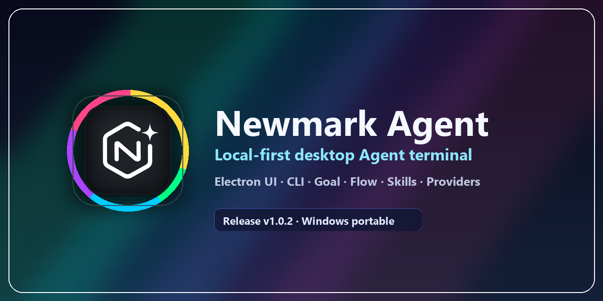

<p align="center">
  
</p>

<h1 align="center">Newmark Agent</h1>

<p align="center">
  A local-first desktop workspace for multi-model agents, coding, automation, research, and controlled computer operation.
</p>

<p align="center">
  
  
  
  
</p>

Newmark Agent brings model routing, persistent workspaces, tools, subagents, workflows, and local state into one desktop application. Connect your own model providers and keep workspace prompts, credentials, conversations, and mutable state under your control.

> Newmark Agent is under active development. Current packages are unsigned prerelease builds.

The `dev-0.2.0` source adds the terminal interface launched with `Newmark --TUI`. It uses the invoking folder as the Workspace, shares Newmark's normal `~/.Newmark` configuration and Conversation store, and retains per-Conversation Plan, Goal, Subagents, Model, and Flow tracking. The TUI supports background Conversation runs, target-bound two-stage stopping, conditional workspace children, Conversation pinning, complete light/dark palettes, Memory Lab Detail, provider/model settings, a persisted Guide/Next default-Enter picker, flat Operations with Automation creation and WorkFlow management, cursor-following long-menu/history scrolling, and a direct Help operation.

The release gate covers DESKTOP, native TUI, CLI, GUI/TUI/CLI shared-backend stress, a real local OpenSSH PTY session, and a WSL 2 Ubuntu 24.04 Linux PTY session.

The locally validated dev-0.2.0 MSI installs a console `Newmark.exe` and registers it in the user PATH, so `Newmark --TUI` can start from any folder while the desktop GUI continues to use `Newmark Agent.exe`.

## Highlights

- **Bring your own models.** Use OpenAI-compatible, Anthropic-compatible, GitHub Models, and custom endpoints.
- **Auditable Auto routing.** Select a concrete model for each turn using capability, quality, cost, speed, reliability, privacy, and user preferences.
- **Durable Agent workspaces.** Keep conversations, Build history, plans, queues, goals, archives, skills, workflows, and media attached to the correct workspace.
- **Controlled tools.** Use terminal, browser, files, GitHub, SSH, automation, MCP servers, and Windows Computer Use through schema validation and policy boundaries.
- **Recoverable long-running work.** Continue from compressed context and query historical Build details without treating unrelated unfinished tasks as the current request.
- **Local-first state.** Store mutable data and credentials under `~/.Newmark`, independently of the installation directory.

## Download

The latest prerelease is `dev-0.2.0`, including the shared-backend TUI and the global `Newmark --TUI` launcher.

### dev-0.2.0

Download packages from the [dev-0.2.0 release](https://github.com/positer/Newmark-Agent/releases/tag/dev-0.2.0).

| Package | Platform | SHA-256 |
| --- | --- | --- |
| `Newmark-Agent-0.2.0-x64.msi` | Windows x64 installer with GUI and global TUI launcher | `75AE06144AA1E6F8A0BC9142C3B243786EE29FCF2E91BA3579083CB6149352CB` |
| `Newmark-Agent-0.2.0-win-unpacked-x64.zip` | Windows x64 portable with GUI and TUI | `B1EACA085B418878FDD4618370D0DF6A63DC6E1D8DE52E37B3A4066E7764B4E4` |

### dev-0.1.12

Download packages from the [dev-0.1.12 release](https://github.com/positer/Newmark-Agent/releases/tag/dev-0.1.12).

| Package | Platform | SHA-256 |
| --- | --- | --- |
| `Newmark-Agent-0.1.12-x64.msi` | Windows x64 installer | `8E242AE760B439D443AA772B3BCD0695698ACEEC5D72FDFF2520D5E2295CF9EB` |
| `Newmark-Agent-0.1.12-win-unpacked-x64.zip` | Windows x64 portable | `F8C03B985BB5CD2B5426D5485436B065F211B615F159925631A8FAAA69DF7CF8` |
| `Newmark-Agent-0.1.12-x86_64.AppImage` | Linux x64 AppImage | `280C46C47ED9CD098EBB2BBCD651F73971CE6A56596F8B6B9FC8D8EAC16F24D8` |
| `Newmark-Agent-0.1.12-amd64.deb` | Debian/Ubuntu x64 package | `D94D21FE0F427F0C42C477C48526A6686D1723439F82658F4BB8A6579CEC4214` |
| `Newmark-Agent-0.1.12-linux-unpacked-x64.zip` | Linux x64 portable | `D32AA71E7A47F584BB421F45D9254B5615A6E99B9F29CECA439C1CB367CBA5D1` |

The Windows MSI requests administrator elevation. Windows and Linux may show an unknown-publisher warning because the packages are not code-signed.

## Quick Start

1. Download the package for your platform from [GitHub Releases](https://github.com/positer/Newmark-Agent/releases).
2. Install the Windows MSI, install the Debian package, run the AppImage, or extract a portable archive.
3. Open **Settings** and add a provider endpoint, API key, and models.
4. Validate the models. Standard-verified models can participate in Auto routing.
5. Create or open a workspace and start a conversation.

Application upgrades preserve existing user state under `~/.Newmark`.

The validated `dev-0.2.0` TUI build is installed machine-wide under `C:\Program Files\Newmark Agent`; both the GUI and repository-external global `Newmark.exe --TUI` launcher were smoke-tested there. The installed package includes the GUI-aligned Build timeline and persisted Guide/Next default-Enter picker. Mutable state remains under `~/.Newmark`, and its configuration is byte-identical to the pre-update baseline. The preceding `dev-0.1.12` Memory Lab optimization remains included: it loads one complete visualization snapshot only when the visualization window opens, Reset is requested, or reindex finishes. Component clicks, Detail navigation, tag search, dragging, and zooming reuse that in-memory snapshot without issuing another relationship or component read. A bounded content/index cache removes repeated disk scans from sustained queries, while explicit reads and visualization refreshes still force one current disk read.

Conversation creation and archiving update the list immediately without waiting for runtime startup, a quiet window, or the slowest archive request. Each archive request settles independently, failed rows roll back independently, and runtime shutdown for different conversations proceeds outside the pool-wide capacity lock. Archive deletion is keyed only by conversation ID, so distinct empty conversations are never collapsed merely because their content matches.

The Agent `bash` tool and the bottom-bar Bash terminal now share a workspace-scoped TypeScript Bash runtime derived from the Apache-2.0 `just-bash` package. Bash built-ins, pipes, redirects, variables, loops, globbing, and text utilities run without depending on a separately installed Bash executable. Agent one-shot calls preflight unsupported commands and retain host-shell compatibility for tools such as Git and npm; bottom-bar Bash sessions preserve `cwd`, reject unsupported host commands with an explicit handoff message, and keep filesystem access inside the active workspace. PowerShell, CMD, pwsh, and POSIX host tabs now use `node-pty` instead of redirected child-process pipes, while the lightweight transcript strips terminal control sequences it cannot render.

A repeatable isolated stress gate is available as `cd DESKTOP && npm.cmd run test:automation-bash-stress`. Its accepted run used a real `%TEMP%` root, 34 automation schedules and 56 triggered Builds, including eight wall-clock timer triggers and 40 overlapping tick attempts. All 56 Builds had unique run IDs and persisted completed records in the configured workspace conversations. The same run exercised 16 persistent native Bash sessions, 320 session commands, 64 parallel one-shot commands, 12 cancellations, host-command fallback, and four real ConPTY PowerShell sessions.

Memory Lab's overview uses one retained node/edge DOM, a single dirty-frame scheduler, and separate physics/paint phases. Bounded sampled repulsion replaces all-pairs work, so large graphs do not rebuild SVG or overlap animation frames while the user drags or clicks. The user-facing Instructions/说明 disclosure, including local root/index/component paths, remains removed.

Scanned-document fallback now follows one enforced order: usable PDF/DOM text, then a screenshot sent to a validated vision model when the selected provider supports vision, and only then bundled offline OCR. The offline fallback uses Tesseract.js 6 with the SIMD core selected by its Node worker and compact Simplified-Chinese/English `best_int` data; a release gate rejects a total OCR payload above 10 MiB. `pdf_read` checks the embedded text layer before rendering a requested scanned page in the built-in Browser. OCR results are explicitly approximate and include a conservative Agent repair instruction for Chinese/English prose and mathematical operators, variables, superscripts, subscripts, and grouping without inventing unsupported text.

## Core Capabilities

### Models and Routing

Auto is a persistent selection mode rather than a hidden model alias. Each turn resolves one concrete provider deployment and records a redacted routing decision. Global Auto can choose across enabled providers; provider Auto remains within the selected provider.

Four routing policies are available:

| Policy | Intended use |
| --- | --- |
| Quality | Prefer the strongest validated result |
| Balanced | Balance quality, cost, latency, and reliability |
| Cost | Prefer economical candidates within a wider quality band |
| Speed | Prefer low latency while retaining reliability limits |

The validation service checks text, streaming, strict JSON, tool selection, argument schemas, tool-result continuation, declared vision input, and image output. Models progress through `discovered`, `basic`, `standard`, and `extended` verification levels.

### Agent Workspaces

- Workspace-scoped conversations and runtime isolation
- Build, Plan, Goal, Guide, and Flow modes
- Persistent linked plans, queues, goals, and Next handoff
- Parallel subagents with durable mailboxes
- Context compression and restart-safe conversation history
- Local folders, external folders, WSL, and SSH-linked workspaces
- Per-conversation model and input-mode preferences

Build history exposes a compact list of user input, final summary, and completion status. Detailed work events are loaded on demand through a read-only history tool. Unfinished work is ordered newest-to-oldest, while status questions remain read-only and do not silently resume an unrelated task.

### Tools, MCP, and Automation

- Compact tool discovery with on-demand JSON Schema provisioning
- Native terminal and persistent terminal takeover
- Built-in browser with observe-then-act Browser Use
- Windows Computer Use with screenshots and UI Automation targets
- Safe file editing, Markdown/PDF preview, and file routing
- Git and GitHub operations, including repository star/fork metadata
- Persistent stdio and HTTP MCP server management
- Skills, Flow workflows, recurring automation, and Memory Lab
- CLI mode with shared schemas, policy enforcement, JSON envelopes, and exit codes

One-use Computer Use screenshots are supplied to the active model request and removed before persistence or replay.

## Provider Configuration

Configure providers in desktop Settings or through Newmark's CLI configuration flows. A typical provider entry is:

```json
{
  "name": "Example Provider",
  "base_url": "https://api.example.com/v1",
  "api_key": "",
  "protocol": "openai",
  "enabled": true,
  "models": []
}
```

Supported paths include OpenAI Chat Completions, OpenAI Responses, Anthropic Messages, GitHub Models, and compatible custom gateways. Keep real credentials in local configuration or an explicitly supported environment/key file. Never commit them.

## State and Privacy

Newmark separates installed application files from mutable user data:

```text
~/.Newmark/
|-- config.json
|-- agent.md
|-- Work/
|-- Flow/
|-- skills/
|-- archive/
|-- Memory Lab/
`-- conversation-media/
```

- Installing under `Program Files`, extracting to another drive, or moving application files does not move the state root.
- Explicit non-install `--root` paths remain available for isolated tests and temporary environments.
- Route, validation, and optional kernel diagnostics exclude API keys, prompt bodies, tool arguments, and file contents.
- External black-box model routers are not required for Auto selection.

## Run from Source

```powershell
git clone https://github.com/positer/Newmark-Agent.git
cd Newmark-Agent\DESKTOP
npm.cmd install
npm.cmd run build
npm.cmd start
```

CLI mode:

```powershell
npm.cmd run start:cli
```

On Windows PowerShell, prefer `npm.cmd` when script execution policy blocks `npm.ps1`.

## Architecture

```text
Electron desktop / CLI
        |
        v
Shared Agent and Tool runtime
        |
        +-- Local Auto Router and Validation Service
        +-- Workspace and conversation runtime pools
        +-- Tool policy and native host boundaries
        +-- OpenAI / Anthropic / GitHub provider adapters
        |
        v
User-selected model providers and local tools
```

Important boundaries:

- One concrete model answer is produced per turn; Newmark does not merge parallel model answers.
- Tool schemas are validated before policy checks and again at native host boundaries.
- OpenAI Chat history is repaired at the transport boundary so every persisted tool call has a matching result before continuation.
- Windows, WSL, and Linux runtimes remain isolated by workspace and conversation.
- Context compression atomically replaces active and persisted Kernel context while preserving the current task boundary.
- Build blocks contain process events; the final Agent response appears once outside its owning Build.
- Build tool activity groups commands and file edits in call order, with expandable per-file change counts and line diffs.
- Diagnostics are disabled by default and expose fingerprints, counts, estimated tokens, cache metrics, and ratios rather than user content.

See [OVERVIEW.md](OVERVIEW.md) for the source tree, subsystem responsibilities, and architecture details. Release-specific changes and validation evidence belong in [GitHub Releases](https://github.com/positer/Newmark-Agent/releases) and the local `archive/` records rather than this product overview.

## Development

### Maintenance Log

- 2026-07-29: Extended the post-release TUI source with a flat `WorkFlow` Operation whose content area lists, expands, and creates FlowEngine workflows, plus a real Automation creation form bound to the active Workspace/Conversation. Long side menus now scroll with their cursor. Conversation history receives the terminal-height remainder while a two-row input viewport stays reserved. Input-top Up enters a Build Block cursor; continued Up scrolls older history only after crossing the visible top, while newer-history scrolling remains input-bottom Down. The Conversation timeline now matches the GUI's run ownership: primary input, collapsible Build Block with persistent duration/fold state, deduplicated Guides, and the owning always-visible final summary remain one strictly ordered `runId` group. Settings / General now opens a real Guide/Next list for the default Enter behavior and persists it through the shared input-mode backend. TUI verification passes 48/48.
- 2026-07-29: Released `dev-0.2.0` with the real terminal UI entry `Newmark --TUI`. The MSI installs a console-subsystem launcher on the user PATH; it preserves the caller cwd, registers or restores it through the existing WorkspaceManager, and shares `~/.Newmark` persistence with GUI/CLI. TUI message wrapping uses terminal display width for CJK/full-width/emoji text and complete light/dark canvases. TUI tests pass 38/38, launcher checks pass 17/17, the full DESKTOP suite passes 1365/1365 plus specialized gates, and shared-backend stress passes five consecutive runs. Real loopback SSH and Ubuntu 24.04 WSL 2 PTY regressions cover the complete interaction flow. See `archive/20260729-tui-cjk-partition-global-launcher.md` and `archive/20260729-dev-0.2.0-tui-shared-backend.md`.
- 2026-07-28: Released `dev-0.1.12`. Memory Lab now performs one visualization retrieval only on open, Reset, or successful reindex; click/drag/zoom/Detail interactions reuse the loaded relationship/content snapshot. Index and component caches cut the accepted 300-component × 600-query P95 to `10.857 ms` (maximum `14.827 ms`), while a complete 300-component visualization refresh took `426.6 ms`. The same disposable-root gate created and archived 120 conversations at zero interval with no loss and P95 interaction latency of `11.8/13.5 ms`. The retained-DOM, non-overlapping frame pipeline and all Windows/Linux release assets passed packaged smoke. See `archive/20260728-dev-0.1.12-memory-lab-snapshot-release.md`.
- 2026-07-28: Advanced source development to `dev-0.1.11` after studying Bilibili `BV15L3F6pEFN`, “记错了比忘了更危险.” Memory Lab now exposes bounded `memory_lab_query`, explicit versioned ADD/UPDATE/DELETE actions, optimistic concurrency guards, recoverable cold archives, and an append-only Policy log. An 18-assertion gate covers relevance filtering, budgets, stale mutation rejection, revision history, deletion recovery, replay order, and Plan read-only enforcement. See `archive/20260728-dev-0.1.11-memory-policy.md`.
- 2026-07-28: Ran packaged Electron and core context stress under disposable `%TEMP%` roots. A zero-interval burst created and archived 120 conversations with zero loss and P95 synchronous interaction latency of `14.7/14.2 ms`; 18 long-context switch cycles with 108 concurrent compression requests lost zero messages. Memory Policy correctness passed at 300 components, but sustained 300-component × 600-query throughput exceeded three minutes because each query rereads every component file. See `archive/20260728-dev-0.1.11-temp-context-conversation-stress.md`.
- 2026-07-28: Advanced source development to `dev-0.1.10` and removed the latency regression from the initial archive-batching design. New conversations paint from the activation snapshot without a redundant runtime state read; archive clicks remove their exact rows immediately, execute independently, coalesce replacement activation and archive-list refresh in the background, and roll back only the failed target in original order. Electron Utility and WSL runtime shutdowns no longer hold the pool-wide capacity lock. Focused gates cover 16 renderer assertions and 20 runtime-pool assertions. See `archive/20260728-dev-0.1.10-parallel-conversation-archive.md`.
- 2026-07-27: Advanced source development to `dev-0.1.9`, increased Memory Lab overview tag-motion damping, stopped incidental graph reloads, made zoom/drag immediate, and bound automations to explicit workspace/conversation Build targets. See `archive/20260727-dev-0.1.9-memory-lab-tag-damping.md` and `archive/20260727-dev-0.1.9-workspace-automation-builds.md`.
- 2026-07-26: Removed Memory Lab's path-bearing Instructions/说明 disclosure and stopped overview component clicks from reloading the panel. The live graph, camera, and DOM stay in place; only Detail performs a non-flashing component-content read. See `archive/20260726-dev-0.1.8-memory-lab-overview-privacy.md`.
- 2026-07-26: Added a hard-budget Chinese/English scanned-PDF and Browser-button fallback: text first, validated vision second, compact offline OCR last. The release rejects more than 10 MiB of OCR payload and verifies formula-aware conservative Agent repair.
- 2026-07-26: Completed the Goal terminal-state UI handoff so an autonomously completed Goal clears its visible bar and returns the selector to Build, and changed newly added models from a 4096-token default context window to 128000.
- 2026-07-26: Built and validated the `dev-0.1.8` Windows/Linux prerelease. Source tests passed on Windows and isolated Ubuntu-24.04, packaged CLI/ZIP/MSI and Flow/SubAgent UI smokes passed, Linux GUI/AppImage/deb/ZIP and exit-lifecycle smokes passed, and production dependency audit reports zero vulnerabilities after upgrading the directly used `glob` runtime to the supported v13 line. See `archive/20260726-dev-0.1.8-release.md`.
- 2026-07-26: Hardened `dev-0.1.8` SubAgent execution and input overlays. Late executor binding no longer loses accepted work, agent-only runtimes execute children inside their explicit root, duplicate model names preserve provider identity, fallback releases stale providers, active close aborts the child, and settlement waiters are cleaned up. The shared floating stack orders scroll-to-bottom above the Flow takeover bubble and persistent input bars with measured 8 px separation; exiting Flow re-enables Next. See `archive/20260726-dev-0.1.8-subagent-reliability-input-float-stack.md`.
- 2026-07-26: Advanced source development to `dev-0.1.8`. Build/Plan/Goal/Flow no longer overwrite the selected input mode during send. Plan must actively read and revision-update the durable conversation Linked Plan; chat summaries cannot replace it, and a successful edit produces a redraw-safe, initially unselected execute-or-supplement card. Goal Guide/Next activates the Goal bar, yields hidden continuation to queued input, evaluates only the active Goal instead of historical unfinished work, and starts every continuation as a new Build after the prior Build has persisted without exposing its synthetic trigger. Flow Next automatically pauses an active queue, injects the selected workflow prompt, exits on manual queue resume, restores the pre-Flow queue state on normal completion, and renders a non-layout-taking Newmark UI takeover bubble. The launching Next is shown in a dedicated Flow-prompt bar rather than the queue, and Flow-only input controls disappear on exit. Idle Guide is handled as Next. Queue handoff now claims and removes the head atomically, with rollback on rejected sends, so a consumed head cannot repeat.
- 2026-07-27: Applied General Settings question strength uniformly to Build, Plan, Goal, Flow, and SubAgent; terminating questions preserve the pre-question mode until a real click. Added explicit light-theme styling and computed-style regression for Flow takeover, Goal/Flow bars, question cards, buttons, and scroll-to-bottom avoidance.

- 2026-07-25: Fixed the dev-0.1.7 inline branch pager disappearing after Build completion or a partial state refresh. Branch metadata now hydrates before destructive transcript redraw and partial responses preserve fields they do not contain; packaged Electron, ZIP, and MSI smoke tests passed. See `archive/20260725-dev-0.1.7-branch-pager-completion-fix.md`.
- 2026-07-25: Rebuilt conversation persistence as a validated tree with a full node index directory, stable viewed-path editing, per-page anchors, cloned Guide Builds, runtime completion isolation, old-version failure canary, and deep/wide branch stress coverage. See `archive/20260725-dev-0.1.7-branch-tree-stability.md`.
- 2026-07-25: Repaired consumer startup and config-refresh reliability for `dev-0.1.7`. The installed payload is now hash-verified, stale temporary shortcuts are removed, one-shot startup state cannot survive a normal reload, runtime cleanup is bounded, renderer/second-instance recovery is explicit, and running Builds show compact changed-file totals. See `archive/20260725-dev-0.1.7-desktop-stability.md`.
- 2026-07-24: Repaired and locally installed the final `dev-0.1.7` Windows build. Real packaged Electron validation now proves `<1/2>`-style navigation stays under the edited node, Guide exposes Copy/Edit, branch switching replaces old Build runs, and edited-file icon/text geometry matches terminal activity rows. See `archive/20260724-dev-0.1.7-local-install.md`.
- 2026-07-24: Advanced the source version to `dev-0.1.7`. Refined branch pagination, active Build restoration, global Guide/Next preference, queue/Goal editing, context-compression feedback, and Build/file disclosure defaults. See `OVERVIEW.md` for details.
- 2026-07-24: Advanced the source version to `dev-0.1.6`. Added a "Default expand tool usage" toggle in General Settings; build blocks now auto-expand while working, auto-collapse when done, and stop auto-managing after the user manually toggles a block. Settings tabs load lazily for faster first-open, and Memory Lab panels fade in to avoid visual flash. See `OVERVIEW.md` for details.
- 2026-07-23: Corrected the first generic-select build's severe layout regression. Enhanced selects now reuse the model selector's actual button/menu classes and one top-layer directional popup positioner; compact labels reserve readable width, repeated clicks fully close generic and model Popovers, popup opening leaves toolbar geometry unchanged, and the terminal shell selector uses the same rounded glass surface. Right-panel file-tree and Flow indicators point right when collapsed and down when expanded. Real Electron acceptance is recorded in `archive/20260723-dev-0.1.5-select-popup-regression.md`.
- 2026-07-23: Built and verified the `0.1.5` Windows MSI and portable ZIP. Machine-wide UAC was cancelled, so the matching package is installed and running from the current-user Programs directory with user configuration unchanged; see `archive/20260723-dev-0.1.5-windows-package-install.md`.
- 2026-07-23: Unified ordinary popup lists with the rounded, scrollable model-selector surface, including mode/intelligence, General settings, GitHub repository, and new-conversation workspace choices. Workspace changes now return the persisted active-conversation snapshot immediately, while cold conversation activation paints disk history before isolated runtime startup; see `archive/20260723-dev-0.1.5-cold-load-select-surfaces.md`.
- 2026-07-23: Advanced the source version to `dev-0.1.5`, inset Build status/chevron controls from the user timeline, and made Memory Lab dragging a lightweight GPU translation with paused simulation and load-time relationship indexes; see `archive/20260723-dev-0.1.5-build-memory-drag.md`.
- 2026-07-22: Corrected the global `Agent.md` editor to use Newmark's theme-native input styling, registered the model-validation background note, deduplicated concurrent validation clicks, preserved manual folding after force stop, and repaired text-usable model false negatives such as DeepSeek v4; see `archive/20260722-agent-prompt-validation-lifecycle.md`.
- 2026-07-21: Prepared the cross-platform `0.1.4` release: General settings can open and refresh the user `config.json`, Models & Providers provides a live user-level `Agent.md` editor, prompt layering normalizes and deduplicates global/workspace prompts, model validation keeps text-usable models available when optional capabilities are unsupported, and explicit Linux tray exit now has a bounded shutdown fallback so it cannot leave a ghost process holding the single-instance lock. Evidence is in `archive/20260721-dev-0.1.4-settings-prompts-validation.md`.
- 2026-07-21: Recovered a local Windows startup failure caused by an incomplete machine-wide installation missing `resources/app.asar`. The verified `0.1.3` unpacked build now runs from the current-user installation path with existing `~/.Newmark` state preserved; see `archive/20260721-213821-startup-recovery.md`.

Run commands from `DESKTOP/`:

| Command | Purpose |
| --- | --- |
| `npm.cmd run build` | Compile TypeScript and generated runtime assets |
| `npm.cmd run typecheck` | Type-check without emitting files |
| `npm.cmd run lint` | Run source lint checks |
| `npm.cmd test` | Run the complete source regression suite |
| `npm.cmd run dist:windows-release` | Build the Windows MSI and portable ZIP |
| `npm.cmd run dist:linux` | Build Linux packages through the Linux/WSL release path |

Generated directories such as `DESKTOP/dist/` and `release/` are not source files and should not be edited by hand.

## Platform Notes

- 2026-07-24: Fixed nested edit pagination so a Guide edit preserves an existing Build-start page group and all earlier path information. Packaged UI validation confirms independent start and Guide pagers; see `archive/20260724-nested-start-guide-branch-pagination.md`.
- 2026-07-25: Queue, Next, and Goal stay bound to the running branch even while a sibling is viewed. The Queue header now has pause/resume beside expand; pausing preserves the queue, activating another running branch atomically rebinds the whole queue, and an explicit Stop/Force Stop pauses injection automatically.

- **Windows:** primary desktop and Computer Use platform; native and WSL Agent backends are available.
- **Linux:** GUI, CLI, terminal, packaging, and normal Agent tools are supported; Windows desktop Computer Use is unavailable.
- **WSL:** the Electron shell remains on Windows while the Agent backend can run in a selected Linux distribution after restart.
- **Signing:** current release artifacts are unsigned development previews.

## Contributing

1. Keep mutable test state in an isolated `--root`.
2. Run `npm.cmd run typecheck`, `npm.cmd run lint`, and relevant tests.
3. Do not commit provider keys, generated release output, local workspaces, or user state.
4. Put release-specific implementation history in release notes or `archive/`, not in this README.

## License

Copyright (c) 2025 Newmark AI. All rights reserved.

Newmark Agent is distributed under the repository's proprietary, all-rights-reserved [LICENSE](LICENSE). Third-party dependencies and assets retain their own licenses; see [THIRD_PARTY_NOTICES.md](THIRD_PARTY_NOTICES.md).
